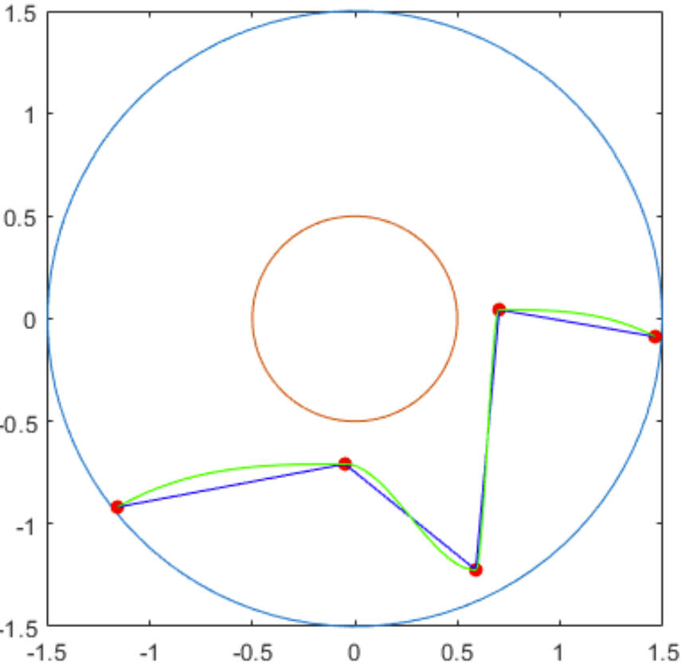
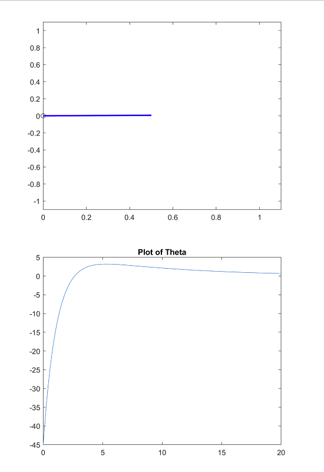
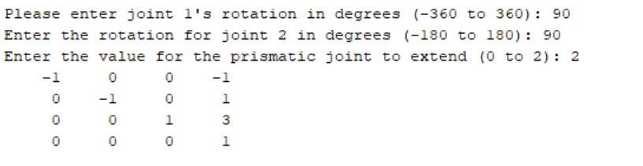

# **Portfolio**

**This page contains brief descriptions and code snippits of past projects. Click on the project for the full code and a more in-depth explanation!**
  

## **1.** [Inverse Kinematics of a Two-Joint Arm to Follow a User Defined Path](https://julian-irizarry.github.io/Robotics/kinematics)

A program written in MATLAB that has a user click to create points to create a path for a simulated arm. The points are interpolated into a smooth curve that the arm navigates using inverse kinematics. No additional packages were used for the animation of the arm or the calculations of the path of the arm.

<small><i>Click on the image below to watch the simulation.</i></small>

  

## **2.** [PID/PD Controller for a Single Arm Robot](https://julian-irizarry.github.io/Robotics/PID)

This project compared PID and PD controllers with how they affected moving a simulated arm to a desired point. The project was done in MATLAB. The only function that was used was ODE45 to solve the differential equation for the controllers.  

<small><i>Click on the image below to watch the simulation.</i></small>

 
  

## **3.** [Forward Kinematics](https://julian-irizarry.github.io/Robotics/PID)

This project uses forward kinematics to simulate the movement of a robot arm that consists of a joint that can rotate 360 degrees, a joint that can rotate 180 degrees, and a prismatic joint that can extend 2 units. All of the joints' angles are entered by the user. 

<small><i>Example User Input</i></small>

<small><i>Click on the image below to watch the simulation.</i></small>

Hello
  
